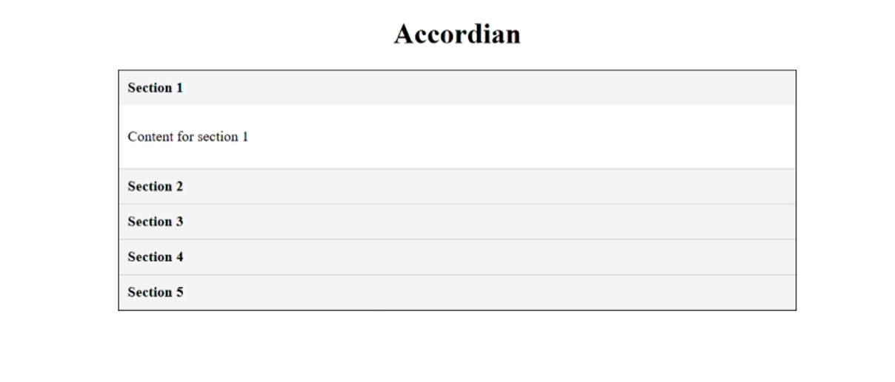

# 04: Accordian

## Machine Coding Series

**🎯 Beginner-Friendly | Vanilla JavaScript | DOM Manipulation**

# Accordion Component

A simple and reusable **Accordion UI Component** built using **Vanilla JavaScript**. This project demonstrates state handling, dynamic rendering, and clean UI design—commonly asked in **machine coding interviews**.

---

## 📸 Preview

---

## 🎯 Features & Requirements

- ✅ Accordion with **5 expandable/collapsible sections**
- ✅ Only one section is open at a time (others remain collapsed)
- ✅ The **active section is visually distinct** from inactive sections
- ✅ Built with **clean and readable JavaScript code**

---

## 🔥 Bonus Implementations

- 📂 **Default Section Expanded** → On initial load, the first section opens automatically
- 📈 **Scalability** → Accordion is easily extensible by simply adding more items to the data array without changing core logic

---

## 🛠️ Tech Stack

- **HTML5** – Markup structure
- **CSS3** – Styling and active/inactive state distinction
- **Vanilla JavaScript (ES6)** – Functionality and state handling

---

## 🧠 Key Concepts Implemented

This project demonstrates several important frontend concepts often asked in **machine coding interviews**:

1. **Data-driven UI Rendering** – Accordion items are generated dynamically from an array of objects instead of hardcoding HTML.
2. **DOM Manipulation** – Creating elements (`createElement`), inserting them into the DOM (`append`), and updating styles dynamically.
3. **Event Delegation** – A single event listener on the container handles all section toggles efficiently.
4. **State Management with Classes** – Active/inactive sections are tracked using `classList`, ensuring only one section stays open.
5. **Toggle Logic** – Uses conditional checks to expand/collapse sections based on their current state.
6. **Default Section Expanded** – First section opens automatically on initial page load.
7. **Scalability** – Adding new accordion sections requires only updating the data array; the logic remains unchanged.

---

